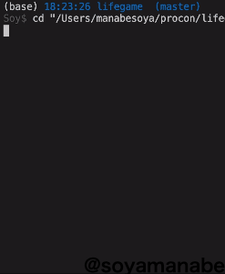

## LifeGame

## Description

LifeGame - Simple life game written in C++.

## Demo


## Usage
* How to #include <bits/>stdc++.h> ??

visit -> [Visual studio codeで競プロ環境構築[mac OS]](https://qiita.com/EngTks/items/ffa2a7b4d264e7a052c6)

* This program receives three stdins.
```
{rows} {lines} {initial cells}
```

Initial cells will be generated in random places.